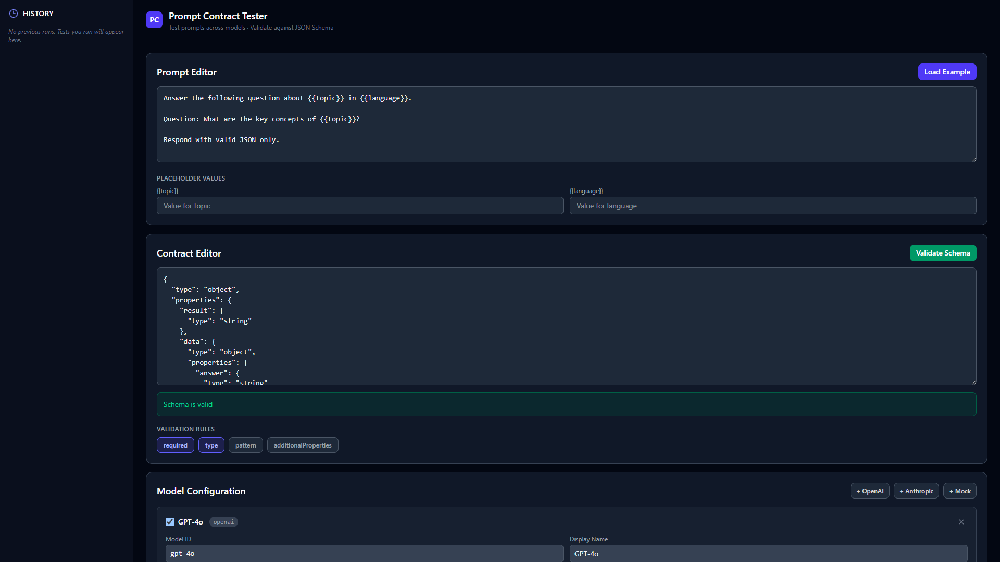

<div align="center">

<br>


<br>


<br>
<br>



<br>
<br>

**Same prompt, multiple models, one contract. Know instantly which one broke.**

</div>

<br>

---

## What problem does this solve?

If you've ever built anything that consumes LLM output as structured data, you already know the pain. You craft a prompt, test it on GPT-4o, it returns perfect JSON every time. Then you try Claude, and suddenly the field names are different. Or the response is wrapped in a markdown block. Or a required field just vanished.

This tool lets you write your prompt once, define exactly what shape the response should have, and then fire it at as many models as you want. Each response gets validated against your schema on the spot. You see pass or fail per model, with the exact validation errors when something goes wrong.

No more guessing. No more copy-pasting responses into a manual checker.

---

## How to use it

```bash
git clone https://github.com/natanaheldr/prompt-contract-tester.git
cd prompt-contract-tester
npm install
npm run dev
```

That's it. Open [localhost:5173](http://localhost:5173) and you're ready to go.

The built-in **Mock adapter** works right away, no API keys needed. When you're ready to test against real models, drop in your OpenAI or Anthropic key. Keys are stored in your browser's localStorage and never touch any server.

---

## What you can do with it

| | | |
|:---|:---|:---|
| **Write prompts** | Type whatever you want, use `{{placeholders}}` for dynamic bits. The editor picks them up and gives you input fields for each one. | |
| **Set your contract** | Paste a JSON Schema that describes the shape you expect. The editor checks it for syntax errors as you go. You can toggle which rules to enforce: required fields, types, patterns, extra properties. | |
| **Pick your models** | OpenAI, Anthropic, and a local Mock adapter come pre-configured. Adjust temperature, max tokens, and drop in your API key. Add more instances if you want to compare different model versions side by side. | |
| **Run everything at once** | Hit Run All. Every enabled model gets the same prompt at the same time. You'll see a progress bar for each one. | |
| **See results** | A table shows latency, pass or fail, token count, and estimated cost per model. Click any row to expand and see the raw response, parsed JSON, and exactly what validation rule failed. | |
| **History** | Every run gets saved to localStorage automatically. The sidebar shows your past runs with timestamps. Click one to bring it back. You can also export results as a JSON file. | |

---

## An example in practice

Say you want models to answer questions about a topic and return structured data.

**The prompt:**

```text
Answer the following question about {{topic}} in {{language}}.
Question: What are the key concepts of {{topic}}?
Respond with valid JSON only.
```

**Your contract:**

```json
{
  "type": "object",
  "properties": {
    "result": { "type": "string" },
    "data": {
      "type": "object",
      "properties": {
        "answer": { "type": "string" },
        "confidence": { "type": "number" }
      },
      "required": ["answer", "confidence"]
    }
  },
  "required": ["result", "data"]
}
```

**Mock adapter responds with:**

```json
{
  "result": "success",
  "data": {
    "answer": "This is a deterministic mock response for testing purposes.",
    "confidence": 0.95
  }
}
```

Contract passes immediately, ~200ms latency, zero cost. Swap in real models once your prompt and contract are solid.

---

## Tech under the hood

<div align="center">

| What | Using | Why |
|:---:|:---|:---|
| UI | React 19 + TypeScript | Components stay predictable with strict types |
| Build | Vite 8 | Instant dev server, fast production builds |
| Style | Tailwind CSS v4 | Dark theme out of the box, minimal CSS |
| Validation | Ajv | Battle-tested JSON Schema validator |
| HTTP | Axios | Clean error handling for API calls |
| Testing | Vitest + RTL | Fast tests, React component rendering |
| Storage | localStorage | No backend, state survives refreshes |

</div>

---

## Adapters included

| | OpenAI | Anthropic | Mock |
|:---|:---:|:---:|:---:|
| **Where it calls** | `api.openai.com/v1` | `api.anthropic.com/v1` | local, no network |
| **How it authenticates** | `Bearer` token | `x-api-key` header | nothing |
| **Error handling** | 401, 429, 5xx | 401, 429, 5xx | can't fail |
| **Typical latency** | 1 to 3 seconds | 1 to 3 seconds | ~200ms |
| **Needs API key** | yes | yes | no |

Every API key you provide lives in your browser's localStorage. The app has no backend. It never sends your keys anywhere except directly to the model provider's API.

---

## How the code is organized

```
src/
├── types/                 Shared interfaces and types
├── context/               Global state via React Context + useReducer
├── adapters/
│   ├── types.ts            Adapter contract
│   ├── openai.ts           Talks to OpenAI's chat API
│   ├── anthropic.ts        Talks to Anthropic's messages API
│   └── mock.ts             Returns a fixed response after 200ms
├── components/
│   ├── Layout.tsx           Page shell with header and sidebar
│   ├── PromptEditor.tsx     Prompt textarea + placeholder inputs
│   ├── ContractEditor.tsx   Schema editor + syntax check + rule toggles
│   ├── ModelConfigPanel.tsx Add and configure model instances
│   ├── TestRunner.tsx       Run All button with per-model progress
│   ├── ResultsDashboard.tsx Results table with expandable rows
│   └── HistorySidebar.tsx   Past runs list, click to restore
├── utils/
│   ├── validateSchema.ts    Compiles and runs Ajv validations
│   ├── storage.ts           Save and load from localStorage
│   ├── costCalculator.ts    Rough cost estimates from token counts
│   └── placeholderParser.ts Find {{keys}} and fill them in
└── styles/
    └── index.css            Tailwind directives + scrollbar tweaks

tests/
├── adapters.test.ts          Mock adapter behavior
├── validateSchema.test.ts    Schema validation edge cases
└── components/
    └── PromptEditor.test.tsx Placeholder detection and user input
```

---

## Commands

| Command | What it does |
|:---|:---|
| `npm run dev` | Start the dev server at localhost:5173 |
| `npm run build` | Type-check and create a production bundle |
| `npm run preview` | Serve the production build locally |
| `npm test` | Run all tests once |
| `npm run test:watch` | Watch files and re-run tests |
| `npm run lint` | Run the linter |
| `npm run format` | Auto-format with Prettier |

---

## Tests

There are 17 tests across 3 files, all passing.

```
✓ tests/validateSchema.test.ts      (8 tests)
✓ tests/components/PromptEditor...  (5 tests)
✓ tests/adapters.test.ts            (4 tests)
```

They cover schema validation with various inputs, the mock adapter's behavior and timing, and the prompt editor's placeholder detection.

---

## Want to contribute?

If you find a bug or have an idea, open an issue or send a pull request. Just make sure `npm test` passes before submitting.

---

## License

MIT. Use it however you want.

<br>

<div align="center">


</div>
